# AI 日报 · Android 客户端

原生安卓 app，用来阅读本仓库每天发布的「AI 日报」。Kotlin + Jetpack Compose（Material 3），单 Activity，无服务器、无账号、**不依赖 FCM / 任何推送服务**。

| 今日（浅色） | 关注专栏 | 栏目页（深色） | 详情 | 设置 | 关注厂商 |
|---|---|---|---|---|---|
| 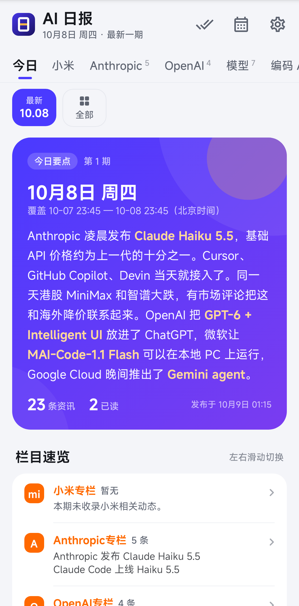 | 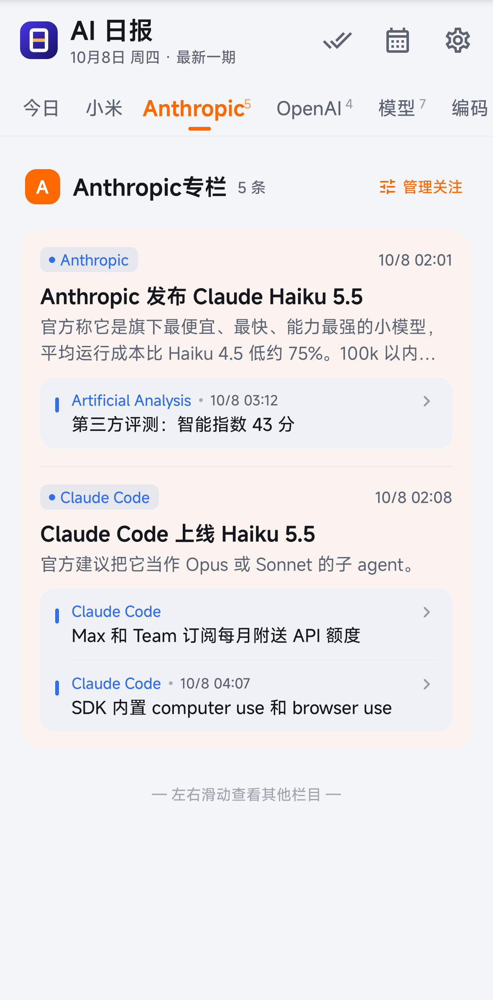 | 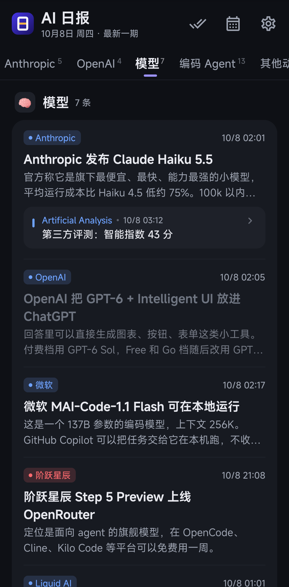 | 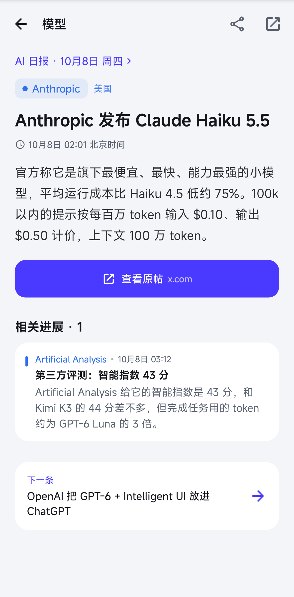 | 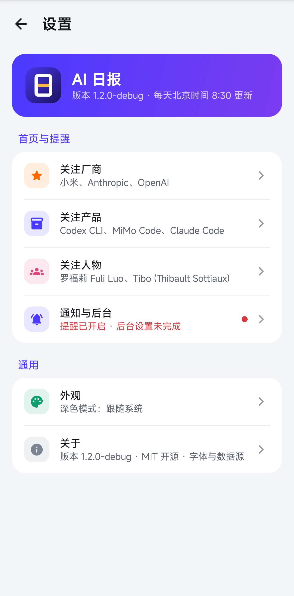 | 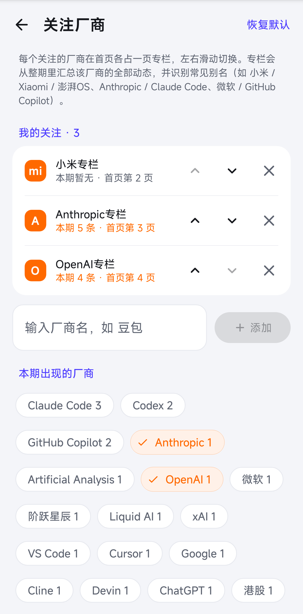 |

**v1.2：版本更新 / 人物动态 / 关注**

| 版本更新 | 人物动态 | 我的关注 | 关注产品 | 关注人物 | 详情（版本） |
|---|---|---|---|---|---|
| 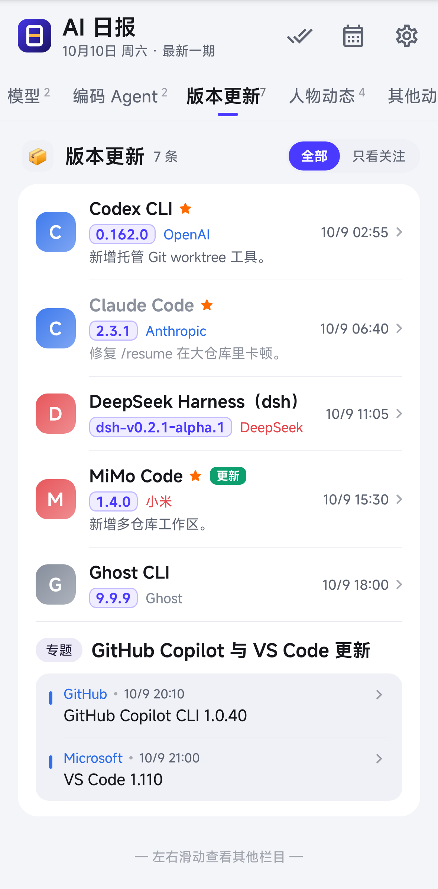 | 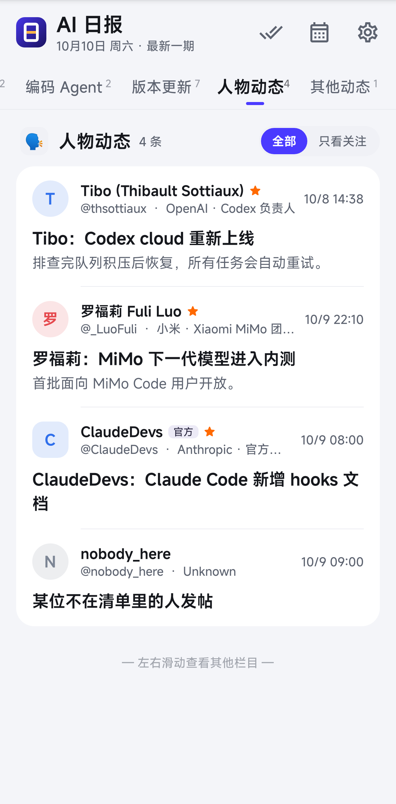 | 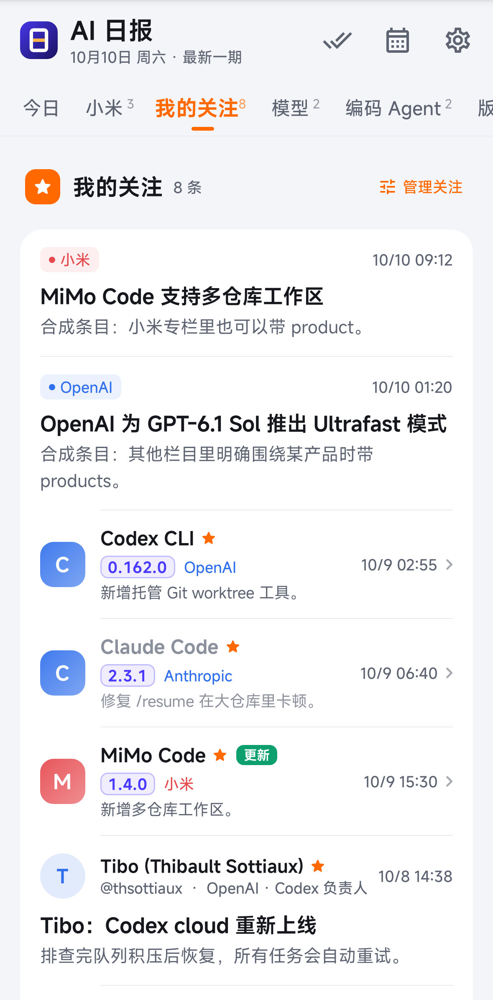 | 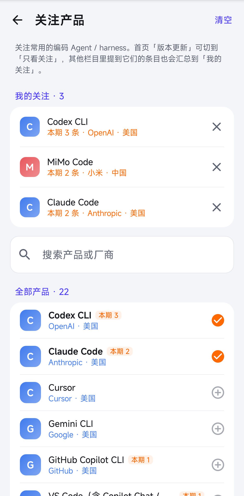 | 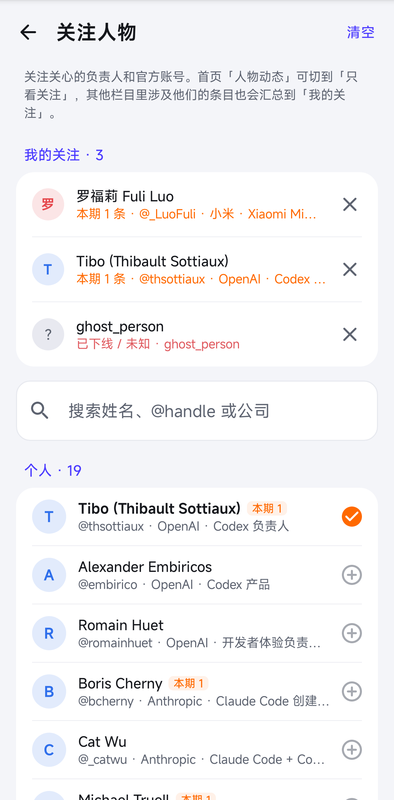 | 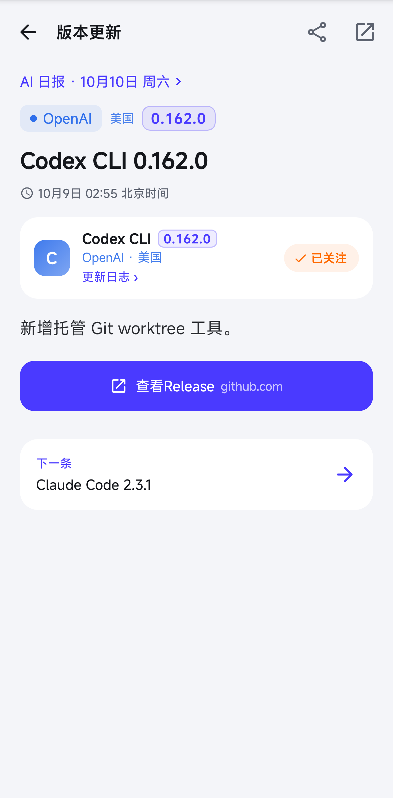 |

更多：[版本更新深色](screenshots/home_releases_dark.png) · [只看关注](screenshots/home_releases_followed_light.png) · [人物动态深色](screenshots/home_people_dark.png) · [关注人物深色](screenshots/follow_people_dark.png) · [详情（人物）](screenshots/detail_person_light.png) · [今日深色](screenshots/home_dark.png) · [小米空专栏](screenshots/home_featured_empty_light.png) · [编码 Agent 页](screenshots/home_sections_light.png) · [设置深色](screenshots/settings_dark.png) · [通知与后台](screenshots/settings_notify_light.png) · [启动图标](screenshots/icon.png)

> 截图由 Robolectric 原生图形渲染真实的 Compose 界面生成（真实主题、MiSans 字体、`data/2026-10-08.json` 样例数据；v1.2 的几张用 `app/src/test/resources/fixtures/` 里的合成一期 + 仓库的 `data/watchlist.json`），见下文「截图」。

## 功能

- **首页（分页）**：顶部吸顶标签条 + 左右滑动分页（`HorizontalPager`）。页序：**今日** → 每个**关注厂商**一页 → 每个栏目一页（模型 / 编码 Agent / 其他动态，标题和图标取自 JSON 的 `sections`）。指示条跟手插值、选中标签自动居中，点标签平滑翻页；每页独立纵向滚动、各自记住位置。
  - **今日**：日期条（最近 30 期 + 「全部」往期面板）、渐变主卡「今日要点」（`**粗体**` 高亮、条数 / 已读数）、「栏目速览」（每页条数 + 前两条标题，点按直达）、补充说明与发布时间。
  - 条目以分组圆角卡片呈现，子条目以内嵌列表显示，`group` 容器显示为「专题」。
- **关注厂商（可自定义专栏）**：默认只关注「小米」（与 1.0 一致），可在「设置 → 关注厂商」增删、排序；支持手动输入，或从本期 / 最近几期出现的厂商、推荐列表（小米、Anthropic、OpenAI、Google、DeepSeek、通义/阿里、豆包、Kimi、智谱、Meta、Microsoft、Cursor……）一键添加。专栏从整期（`xiaomi.items` + 全部 `sections`，深度优先）收集 vendor 匹配的条目：不区分大小写，带一张小别名表（小米 ↔ Xiaomi ↔ Mi ↔ 澎湃OS，Anthropic ↔ Claude Code，OpenAI ↔ ChatGPT / Codex，微软 ↔ Microsoft ↔ GitHub Copilot ……），父条目匹配则整条收录，按 id 去重；关注小米时 schema 的 `xiaomi.items` 优先排在最前。没有动态时显示「本期未收录{厂商}相关动态」。纯客户端功能，不需要改数据格式。
- **版本更新（`releases`）/ 人物动态（`people`）**（v1.2）：仍是通用栏目页，但条目用定制样式——
  - 版本更新：紧凑行，产品标（区域色）+ 产品名（取自 `watchlist.json`，没有则用标题去掉版本号）+ 版本号徽标（原文，等宽数字）+ 厂商 + 北京时间，点按进详情；
  - 人物动态：头像 + 人名 + `@handle` + 组织 · 身份（取自清单；清单里没有的人显示原始 id 和 vendor），下方是帖子标题与摘要；
  - 页头有「全部 / 只看关注」切换：没选过时，关注了对应类别（产品 / 人物）就默认「只看关注」，否则「全部」；切换后记住选择。只看关注但没有命中时给出「看全部 / 去关注」入口。
- **自定义关注产品 / 人物**（v1.2）：「设置 → 关注产品 / 关注人物」两个二级页，列出 `data/watchlist.json` 的 harness 产品与人物（个人、官方账号分组），可搜索，显示本期命中条数。只存 id；清单里已经没有的 id 会保留并标成「已下线 / 未知」，可手动移除，不会被自动删掉。关注了任何产品或人物后，首页多出一页「**我的关注**」，跨栏目汇总命中的条目。
  - 匹配规则同 schema：条目产品集 = `{product} ∪ products`，人物集 = `{person} ∪ people`（去重、id 不区分大小写），命中任一已关注 id 即算，跨栏目，子条目同规则（父条目命中则整条收录）；未知 id 忽略不崩。与按 vendor 的「关注厂商」专栏互相独立。
  - 详情页：版本号徽标；「关联」卡片列出条目涉及的产品 / 人物，可一键关注，可打开更新日志 / X 主页。
- **详情**：厂商标签（中国红 / 美国蓝 / 国际灰）+ 区域、北京时间、标题、摘要、「更新」徽标与更新说明、原帖按钮（Custom Tabs，没有支持的浏览器时退回系统浏览器）、相关进展、下一条、分享。
- **已读**：打开详情即标记已读（DataStore 持久化），列表中已读标题渐变为灰；顶栏可一键全部已读——不弹窗，按钮就地变成「✓ 已读」胶囊、主卡已读数翻动。
- **离线**：`index.json` 与每期 JSON 原样缓存在 app 私有目录；断网时显示缓存并提示。单期若在索引中的 `published_at` 变化（修订重发）会自动重新拉取。
- **下拉刷新**；冷启动先显示缓存，再联网。
- **每日自动检查 + 本地通知**（见下）。
- **深色模式**：跟随系统 / 浅色 / 深色。窗口底色、系统栏随 app 内主题切换，页面转场全程不透明（深色下进设置不闪白）。
- **设置**：一级是目录（关注厂商 / 通知与后台 / 外观 / 关于），各项是独立二级页。
- 只认 `**粗体**`（非贪婪 `\*\*(.+?)\*\*`），**从不按 HTML 解析**；忽略未知 JSON 字段，未知 `region` 按 `intl` 处理。

## 数据获取

- 先请求 `https://raw.githubusercontent.com/WikG1018/ai-daily/main/<path>`，**8 秒内失败**（`callTimeout`）再请求 `https://cdn.jsdelivr.net/gh/WikG1018/ai-daily@main/<path>`。
- 不看 `Content-Type`（Raw 返回 `text/plain`），直接按 JSON 解析。
- OkHttp 不配置 HTTP 缓存；请求 `index.json` 额外带 `CacheControl.FORCE_NETWORK` 与 `Cache-Control: no-cache`，绕开 jsDelivr 的 7 天 `max-age`。
- 镜像返回的索引如果比本地已有的旧（`latest` 更小），不会把本地降级。
- `data/watchlist.json`（v1.2）：同样的双源 + 绕缓存策略；本地缓存超过 20 小时才联网刷新（≈ 每天随 index 一次；下拉刷新放宽到 1 小时；后台每日检查时也会顺带刷新）。失败一律回退离线缓存；没有清单时一切照常，只是缺少人名 / 产品名等补充信息。启动路径上的清单读取全部包在 try 里，绝不影响启动。

## 每天早上自动提醒（无 FCM）

简报每天北京时间约 8:17 开始生成、8:30 前发布。app 用 WorkManager 两条腿走路：

1. **早间链**（一次性任务，自己排下一次）：8:35 首次检查；没发布就每 20 分钟重试到 12:00，之后每 2 小时，22:00 后停到第二天 8:35；拿到当天这期后直接排到明天 8:35。
2. **兜底周期任务**：每 3 小时一次，顺带把断掉的早间链接上。
3. **打开 app 时**也会检查。

检查逻辑：拉 `index.json`，若 `latest` 比本地记录的大（字符串比较），就预取该期（保证点开通知时离线也能看），并用 `issues[0].highlights` 作为正文发本地通知，点击直达当期（`aidaily://issue/YYYY-MM-DD`）。前台已看过的期数不会再通知；首次安装只建立基线、不打扰。

**小米 / 澎湃 OS**：系统默认限制后台，app 的「设置 → 通知与后台」页有分步引导和跳转按钮：自启动管理、省电策略「无限制」、系统电池优化白名单、锁定最近任务、通知横幅。首页也会提示未完成的设置。

> 厂商推送（小米推送 MiPush / 统一推送联盟 UPS）**不集成**，可作为以后的可选模块：只需在 `work/` 旁新增一个推送入口，复用 `DailyChecker` 的去重与通知逻辑即可。

## 字体：MiSans

按《MiSans 字体知识产权许可协议》，可以免费商用、可以把字体用在 app 里分发，但**不得单独再分发字体文件**，且需在软件中注明使用了 MiSans。因此：

- 仓库里**不放任何字体文件**（`.gitignore` 已忽略 `*.otf/*.ttf`）。
- 构建时 Gradle 任务 `fetchMiSans` 从小米官网 `https://hyperos.mi.com/font-download/MiSans.zip` 下载（约 230 MB，缓存在 `~/.gradle/caches/ai-daily/misans/`，只下一次），取 Regular / Medium / Semibold 三个字重打进 APK 的 `assets/fonts/`，并附带官方许可协议 PDF。
- 下载失败时自动退回系统字体（`-Pmisans.required` 可让下载失败直接构建失败，发版时建议加上；`-Pmisans.skip` 跳过下载）。
- 「设置 → 关于」中注明了「本应用使用 MiSans 字体（© 小米科技）」。

## 构建

环境：JDK 17+（已用 JDK 21 验证）、Android SDK（platform `android-37.0`、build-tools 36+）。AGP 9.1.1（内置 Kotlin，KGP 2.2.10）+ Gradle 9.3.1（wrapper 自带）。`minSdk 31`（Android 12+）、`targetSdk 37`。

```bash
cd android
echo "sdk.dir=/path/to/Android/Sdk" > local.properties   # 或设置 ANDROID_HOME
./gradlew :app:assembleDebug          # 调试包：app/build/outputs/apk/debug/app-debug.apk（包名 com.wikg.aidaily.debug）
./gradlew :app:testDebugUnitTest      # 单元测试 + Robolectric 端到端冒烟测试
```

### 签名发布包

签名密钥**不入库**。通过环境变量提供（二选一）：

```bash
# 方式 1：指向一个 properties 文件（storeFile / storePassword / keyAlias / keyPassword）
export AIDAILY_SIGNING_PROPERTIES=/home/box/secrets/ai-daily-signing.properties

# 方式 2：直接给环境变量（适合 CI）
export AIDAILY_KEYSTORE=/path/to/ai-daily-release.jks
export AIDAILY_KEYSTORE_PASSWORD=...
export AIDAILY_KEY_ALIAS=aidaily
export AIDAILY_KEY_PASSWORD=...

./gradlew :app:assembleRelease -Pmisans.required
# 产物：app/build/outputs/apk/release/app-release.apk（R8 混淆 + 资源压缩，v2/v3 签名）
```

没有提供签名信息时 `assembleRelease` 仍能成功，但产出未签名的 APK。

生成新密钥（只需一次，务必备份，丢了就无法覆盖升级）：

```bash
keytool -genkeypair -keystore ai-daily-release.jks -storetype PKCS12 -alias aidaily \
  -keyalg RSA -keysize 4096 -validity 36500
```

当前发布用证书 SHA-256：`77:A5:7D:2F:0F:07:7D:90:B4:0D:DB:82:1A:F4:50:84:E9:AE:59:4D:A4:08:6E:12:25:DC:91:84:8C:B5:F0:A2`

## 安装

从 [Releases](https://github.com/WikG1018/ai-daily/releases) 下载 `ai-daily-*.apk`，在手机上打开安装（小米手机需允许「安装未知应用」）。装好后：

1. 允许通知；
2. 进入「设置 → 通知与后台」，按小米后台设置的几步操作（自启动、省电策略无限制）；
3. 需要的话在「设置 → 关注厂商」里添加想单独成页的厂商（默认是小米）。
4. 想只看某几个编码 Agent 的新版本或某几位负责人的动态，到「设置 → 关注产品 / 关注人物」里勾选。

## 截图

```bash
./gradlew :app:testDebugUnitTest -Pscreenshots --tests '*ScreenshotTest*'
```

用 Roborazzi + Robolectric（`GraphicsMode.NATIVE`）把真实的 Compose 界面渲染成 PNG，写到 `android/screenshots/`。

测试全部离线、不依赖线上数据：端到端冒烟测试把 `DailyApi.offlineForTests` 打开，用固定的样例 / 合成数据预置缓存。

## 目录结构

```
app/src/main/java/com/wikg/aidaily/
├── AiDailyApp.kt          # Application + 手写依赖容器，启动时排定后台任务
├── MainActivity.kt        # 单 Activity、深链（aidaily://issue/… / aidaily://item/…）
├── data/
│   ├── model/             # index.json / 单期 JSON 数据模型；Featured.kt：关注厂商匹配与别名表；Watchlist.kt：关注清单与产品 / 人物匹配
│   ├── remote/DailyApi.kt # OkHttp：Raw → jsDelivr 回退、绕开缓存
│   ├── local/             # 离线缓存（文件）+ DataStore（已读、最新期、设置）
│   └── DailyRepository.kt
├── work/                  # WorkManager 调度、检查逻辑、本地通知
├── ui/                    # Compose：theme / components / home / detail / settings / 导航
└── util/                  # 粗体解析、北京时间格式化、Custom Tabs、小米后台设置跳转
```

包名 `com.wikg.aidaily`，minSdk 31（Android 12+），target/compile SDK 37。
